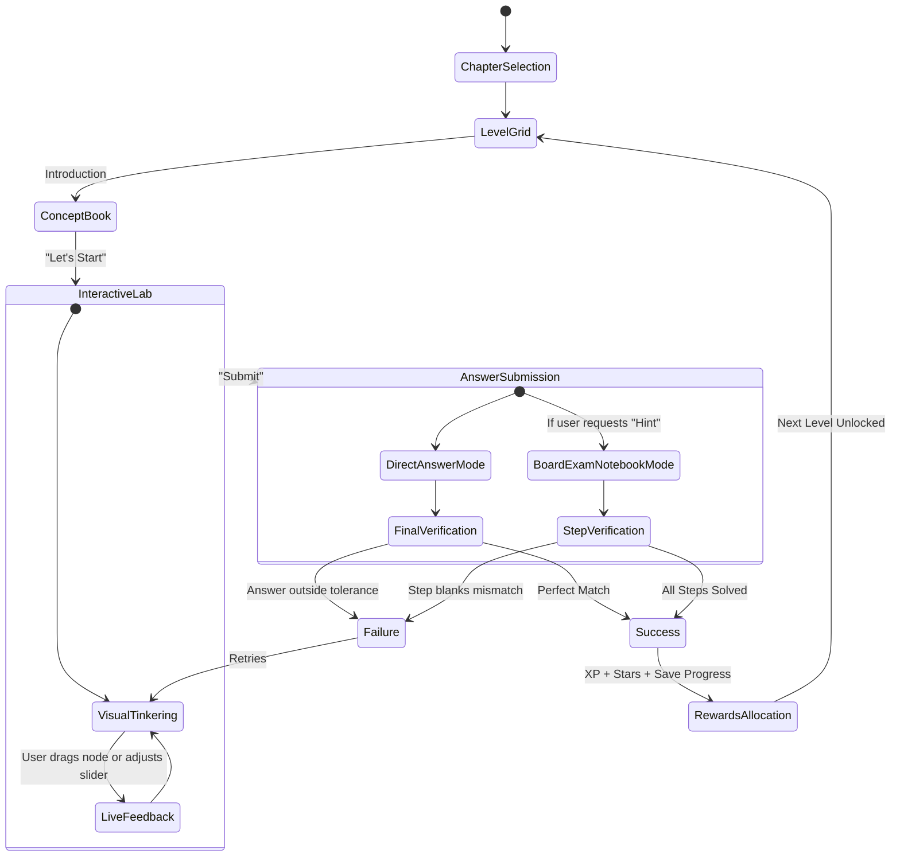

# Business Logic: Gamified Math Framework

This document outlines the business rules, gamification loops, curriculum mapping, and educational logic that power the **GanitQuest** platform.

---

## 1. Core Educational Thesis

Traditional mathematics education—especially in secondary school curricula like **CBSE/NCERT Class X**—often suffers from two primary friction points:
1. **Passive Observation**: Students memorize equations (e.g., volume of a sphere or trigonometry ratios) without developing physical or spatial intuition.
2. **Formula Insulated Steps**: Exams require rigorous, multi-line proofs, but tools only test final answers (multiple-choice or final inputs), leaving students unprepared for actual paper-and-pencil board exams.

**GanitQuest** solves this by introducing a dual-mode active learning model:
- **Spatial Intuition Labs**: Powered by real-time interactive Phaser models where dragging vertices or scaling sliders visually changes coordinates, angles, and volumes.
- **Board Exam Worksheets (Notebook Mode)**: Transcribing raw values directly into lined digital worksheets, forcing students to type intermediate formula steps to replicate board exam grading patterns.

---

## 2. Curriculum Mapping (NCERT Class X)

The initial system focuses on the three most spatial/visual chapters of the Class X Mathematics syllabus:

| Chapter | Title | Active Geometry Lab Core Mechanics | Covered Subtopics |
| :--- | :--- | :--- | :--- |
| **Chapter 7** | **Coordinate Geometry** | Drag-and-snap coordinate points on Cartesian grids; reflections; distance lines. | Abscissa, ordinates, quadrants, distance formula, midpoint formula, section formula dividing lines. |
| **Chapter 8** | **Introduction to Trigonometry** | Interactive unit-circle sweeping, Right-angle triangle scaling, heights & distances silhouette landscapes. | Bench angles ($30^\circ$, $45^\circ$, $60^\circ$, $90^\circ$), ratios ($\sin$, $\cos$, $\tan$), identities ($\sin^2\theta+\cos^2\theta=1$), elevation/depression angles. |
| **Chapter 12** | **Surface Areas & Volumes** | 3D shape expansion sliders, combination solids (cylinder with hemisphere caps). | Cube, cuboid, cylinder, cone, sphere, hemisphere capacity and outer boundary areas. |

---

## 3. The Core Game Loop

The user flow is structured to reward active manipulation before forcing formal symbolic entry.

---

## 4. Detailed Progression & Reward Mechanics

### A. Level Snapping and Accuracy Calculations
In direct input modes (like 3D shapes), the system computes real-time accuracy based on how close the user's current model dimensions are to the level's objective:

$$\text{Accuracy (\%)} = \max\left(0, \min\left(100, 100 \times \left(1 - \frac{|\text{Live Volume} - \text{Target Volume}|}{\text{Target Volume}}\right)\right)\right)$$

- **Perfect Match Status**: Triggered when the difference falls within the specified tolerance. In Phaser, the shape flashes green, showing "Perfect Match! Ready to Submit".
- **Dynamic Hints**: Real-time HUD elements indicate whether the shape is "Too Small! Increase values" or "Too Large! Reduce values".

### B. Scoring and XP Formula
Completing a level awards metrics to update user profiles in the MySQL database:

$$\text{XP Awarded} = (\text{Base XP for Level}) + (\text{Speed Bonus}) - (\text{Hints Used Penalty})$$

- **Base XP**: Easy levels award **20 XP**; medium multi-step levels award **50 XP**; boss levels award **100 XP**.
- **Stars Metric**: Users receive up to **3 Stars** per level depending on speed, accuracy, and whether they solved the challenge without switching to the Board Exam notebook hint:
  - **3 Stars**: Perfect answer on first submission without step hints.
  - **2 Stars**: Perfect answer after using hints or multiple attempts.
  - **1 Star**: Solved with low accuracy threshold matching.

### C. Gating & Unlocks
Levels are grouped under **Worlds** in each Chapter:
- Completing a level unlocks the next sequential level (`lvl-01` $\rightarrow$ `lvl-02`).
- Worlds represent a sub-topic (e.g., World 3: Distance Formula). Unlocking a new World requires clearing at least 80% of the previous World's levels.
- A final "Boss Level" (e.g., combining section formula with area calculations or complex multi-step heights & distances) gates chapter completion.

---

## 5. Intermediate Verification Logic (Worksheet Blanks)

When a student clicks the "Do you want a Hint?" button, the application shifts from a simple input box to a multi-stage lined notebook showing a step-by-step NCERT board solution template.

### Example: Chapter 12 capacity level (`lvl-13`)
- **Question**: A warehouse is size $20\text{m} \times 10\text{m} \times 25\text{m}$. How many boxes of size $2\text{m} \times 1\text{m} \times 0.5\text{m}$ fit inside?
- **Intermediate Steps Required**:
  1. Volume of Warehouse ($V_1$) = `[ 5000 ]` $\text{m}^3$ (Step 1 verification)
  2. Volume of 1 Box ($V_2$) = `[ 1 ]` $\text{m}^3$ (Step 2 verification)
  3. Total Number of Boxes ($N$) = `[ 5000 ]` (Final answer verification)

### Validation Rules:
- Intermediate string fields are sanitized (whitespace trimmed, trailing units discarded).
- Numerical values are evaluated using a strict tolerance comparison ($|V_{\text{user}} - V_{\text{correct}}| \le 0.05$ for floating-point values) to accommodate variations in decimals ($\pi \approx 3.14$ vs. $22/7$).
- The final level progress is only committed to state once **all** blanks are filled correctly. This encourages students to practice the physical writing style expected by school examiners.
