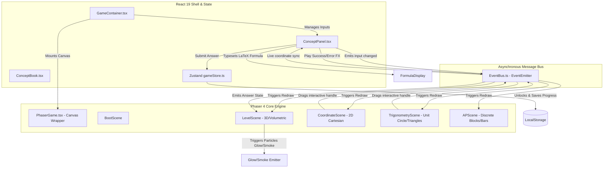

# Deep-Dive Technical Architecture: MathQuest Gamified Frontend Engine

This document provides a highly technical, end-to-end breakdown of the frontend architecture of **MathQuest**. It explains the layout, design decisions, execution loops, mathematical models, and the event-driven bridge connecting **React** and **Phaser 4**.

---

## 1. System Interaction Architecture

The MathQuest frontend is a hybrid of a **Declarative React UI shell** (handling menus, inputs, global progression, notebook forms, and math typesetting via KaTeX) and an **Imperative Phaser HTML5 Canvas** (managing rendering pipelines, procedural vectors, dragging mechanics, physics feedback, and interactive gameplay).



### Unidirectional & Bidirectional State Sync Loop
1. **Declaring Levels**: React loads a specific `:levelId` from URL params. It reads layout parameters from the decoupled spec sheets.
2. **Mounting Phaser**: `PhaserGame.tsx` boots the Phaser engine, registers all scenes (`BootScene`, `LevelScene`, `CoordinateScene`, `TrigonometryScene`, `APScene`), and binds event listeners.
3. **Double-Bind Control Action**:
   - **React to Phaser**: Typing dimensions in `ConceptPanel.tsx` triggers `EventBus.emit('user-input-changed')`. The active Phaser scene consumes this event and runs smooth tween scale animations to visually morph the geometry.
   - **Phaser to React**: Dragging grid handles in `CoordinateScene.ts` calculates coordinates instantly relative to the screen axis, triggering `EventBus.emit('coordinate-point-dragged')`. React catches this to auto-fill input fields.

---

## 2. The Core React-Phaser Bridge (`EventBus.ts`)

Because React manages a virtual representation of the DOM while Phaser executes a high-fidelity $60\text{ FPS}$ draw loop inside a standard `<canvas>` container, direct reference bindings would result in DOM race conditions and state fragmentation. Instead, communication is entirely message-driven.

### Event Schema Definitions (`EventBus.ts`)
The bridge is built atop a custom instantiation of a global `Phaser.Events.EventEmitter` which acts as our system message bus:

| Event Identifier | Payload Signature | Source | Target | Architectural Purpose |
| :--- | :--- | :--- | :--- | :--- |
| `game-ready` | `void` or `Phaser.Game` | Active Phaser Scene | `PhaserGame.tsx` | Signals that the canvas is initialized and ready to draw. |
| `load-level` | `levelData: any` | React Container | All Active Scenes | Clears old assets and triggers camera-zoom entry sequences. |
| `user-input-changed` | `{ value: string, levelId: string }` | React Inputs / Phaser | Phaser Scene / React | Syncs direct numeric inputs/sliders between visual scaling and states. |
| `board-exam-input-changed` | `{ inputs: string[], levelId: string }` | React Notebook Blanks | Phaser Scene | Feeds multi-step equation blocks into the visual solver canvas. |
| `coordinate-point-dragged` | `{ x: number, y: number, label: string, index: number, levelId: string }` | Draggable Scene Nodes | `ConceptPanel.tsx` | Maps mechanical pixel movements to clean, rounded Cartesian space values. |
| `answer-correct` | `void` | React Validation Form | `LevelScene.ts` | Triggers correct-answer audio cues and bursts golden glitter particles. |
| `answer-wrong` | `void` | React Validation Form | `LevelScene.ts` | Triggers error audio cues and shoots gray cloud/smoke feedback particles. |

---

## 3. React Canvas Lifecycle Wrapper (`PhaserGame.tsx`)

To safely embed the canvas within React, the wrapper component must implement clean mounting hooks and robust teardown logic. Failure to do so would result in memory leaks, context collisions, and duplicated canvas layers upon hot-reloads.

### Mounting & Lifecycle Cleanup Rationale
The core logic utilizes a hybrid `useLayoutEffect` and `useRef` architecture:

```typescript
// From PhaserGame.tsx
const game = useRef<Phaser.Game | null>(null);
const gameReadyRef = useRef(false);

useLayoutEffect(() => {
    let onGameReady: (() => void) | null = null;
    
    if (game.current === null) {
        // Initialize Phaser Game instance
        game.current = new Phaser.Game({ ...config, parent: 'game-container' });

        onGameReady = () => {
            gameReadyRef.current = true;
            setIsGameReady(true);
            if (currentLevelData) {
                setIsLoadingLevel(true);
                EventBus.emit('load-level', currentLevelData);
                setTimeout(() => setIsLoadingLevel(false), 600);
            }
        };
        // Listen to scene boot ready signals
        EventBus.on('game-ready', onGameReady);
    }

    // CRITICAL: Complete Teardown to prevent memory leakage
    return () => {
        if (onGameReady) {
            EventBus.off('game-ready', onGameReady);
        }
        if (game.current) {
            // Destroy all WebGL/Canvas contexts and detach all events
            game.current.destroy(true);
            game.current = null;
        }
    };
}, []);
```

### Event Subscription Teardown in Phaser Scenes
Each scene binds callback methods. Upon scene destruction or switches, these listeners must be safely detached from the shared `EventBus` to prevent memory leaks and ghost calculations:

```typescript
// From CoordinateScene.ts
const cleanup = () => {
    EventBus.off('load-level', onLoadLevel);
    EventBus.off('user-input-changed', onUserInputChanged);
    EventBus.off('board-exam-input-changed', onBoardExamInputChanged);
};
// Bind to Phaser's internal scene destruction hooks
this.events.once('shutdown', cleanup);
this.events.once('destroy', cleanup);
```

---

## 4. Mathematics Specification Engine (`levelSpecs.ts`)

Instead of hardcoding equations inside the layout layers, the curriculum is entirely schema-driven. This allows the application to dynamically swap math validation, tolerance metrics, and custom rendering parameters on a per-level basis.

### Spec Sheet Configuration Schema
Every mathematical challenge is governed by the `LevelSpecification` interface:

```typescript
export interface LevelSpecification {
  id: string;                                                    // Unique database key (e.g. lvl-cg-08)
  question: string;                                              // Raw math challenge wording
  inputLabel: string;                                            // Dynamic badge tag for forms
  placeholder: string;                                           // Form placeholder text
  correctAnswer: number;                                         // Precalculated solution target
  tolerance: number;                                             // Maximum allowable decimal variation limit
  calculateValue: (input: number) => number;                     // Validation function
  getDimensionsLabel: (input: number) => string;                 // UI measurement text
  formulaDisplay: string;                                        // LaTeX representation string
  bookPage: BookPage;                                            // Textbook formulas and tip steps
  boardExamLines?: BoardExamLine[];                              // Steps notebook structure
  points?: Array<{ x: number, y: number, label: string, draggable?: boolean }>; // Grid positions
  lineConnections?: Array<[number, number]>;                     // Laser-beam polygon layouts
  trigMode?: 'angle' | 'ratio' | 'identity' | 'complementary' | 'heights_distances';
  apMode?: 'pattern' | 'difference' | 'nth_term' | 'sum' | 'realworld';
}
```

---

## 5. Phaser Scene Implementation and Mathematical Visualization

The core interaction of MathQuest is split across four highly optimized, domain-specific visual engines.

---

### A. Coordinate Geometry Lab (`CoordinateScene.ts`)

Renders interactive Cartesian systems and measures distances, midpoints, coordinates, and perimeter areas in real time.

```
                  Y Axis
                    |  Draggable Node
                    |       o (x, y) 
                    |      . . 
   - projectionY - -|- - - - - - - [labelText: P (x, y)]
                    |      .
                    |      . projectionX
                    |      .
--------------------0-------------------- X Axis
                    |
                    |
```

#### 1. Discrete Integer Snapping Logic
Draggable handles are mathematically mapped from pixel coordinates $(X_{\text{pixel}}, Y_{\text{pixel}})$ to the Cartesian system $(x_{\text{grid}}, y_{\text{grid}})$. When released (`dragend`), they snap to integer points:

```typescript
// From CoordinateScene.ts in circle.on('drag') callback
const liveGridX = Math.round((clampedX - this.centerX) / this.spacing);
const liveGridY = Math.round(-(clampedY - this.centerY) / this.spacing);

// On drag end, perform spring snap tween
circle.on('dragend', () => {
    const snappedX = this.centerX + pointData.gridX * this.spacing;
    const snappedY = this.centerY - pointData.gridY * this.spacing;

    this.tweens.add({
        targets: [circle, halo],
        x: snappedX,
        y: snappedY,
        duration: 100,
        ease: 'Power2',
        onUpdate: () => {
            labelText.x = circle.x + 14;
            labelText.y = circle.y - 14;
            this.updateProjections(pointData);
            this.updateLaserLines();
        }
    });
});
```

#### 2. Visual Laser Guideline Render Loops
- **Projection Guides (`updateProjections`)**: Projects thin, dashed perpendicular lines from nodes to the $X$ and $Y$ axes to visually reinforce grid coordinates:
  $$\text{proj}_{X} = \text{lineBetween}(P_x, P_y \rightarrow P_x, \text{centerY})$$
  $$\text{proj}_{Y} = \text{lineBetween}(P_x, P_y \rightarrow \text{centerX}, P_y)$$
- **Laser Vectors (`updateLaserLines`)**: Connects discrete coordinates with glowing, high-contrast laser lines (using multi-layer graphics to generate volumetric neon filters) to illustrate vectors, distances, or polygonal boundaries.

---

### B. Trigonometry Lab (`TrigonometryScene.ts`)

Explains trigonometric concepts visually, supporting 5 distinct pedagogical modes.

```
       Mode 1: Angle Foundations              Mode 2: Trig Ratios Triangle
             
                  Sweep Peak                             C (Top Vertex)
                   o (Handle)                            |\
                  / .                                    | \  Neon Cyan
                 /   . Arc                               |  \  (Hypotenuse AC)
                /     .                                  |   \
               /θ      .                                 |    \
   -----------0--------- Base (cx)         Neon Pink --->|  θ  \
                                           (Opposite AB) |______\ A (Base)
                                                        B (Adjacent BC - Neon Indigo)
```

#### 1. Magnet Angle Snapping (Quadrant I)
Quadrant I sweeps ($0^\circ$ to $90^\circ$) utilize magnetic angle snapping. If the handle gets close to benchmark mathematical angles, it locks onto them:

```typescript
const benchAngles = [0, 30, 45, 60, 90];
for (const bench of benchAngles) {
    if (Math.abs(angleDeg - bench) < 3.0) {
        angleDeg = bench;
        if (this.lastSnappedAngle !== bench) {
            this.lastSnappedAngle = bench;
            this.triggerSnapFlash(); // Plays haptic scale bounce
            soundManager.playSnap(); // Plays dynamic snap audio feedback
        }
        break;
    }
}
```

#### 2. Unit Circle & The Pythagorean Identity Lab
Models the unit circle ($R = 1$) to visually demonstrate that the sum of the squares of sine and cosine is always equal to 1, regardless of the angle:
$$\cos\theta = \Delta x, \quad \sin\theta = \Delta y$$
$$\sin^2\theta + \cos^2\theta = 1.00$$

- Sine is projected as a **neon pink** vertical laser line.
- Cosine is projected as a **neon indigo** horizontal laser line.
- The hypotenuse acts as a **neon cyan** unit radius beam.

#### 3. Heights & Distances Silhouette Landscapes
Converts trigonometry into a real-world simulation by overlaying geometric diagrams onto vector graphics of mountains and observation towers:
- Uses angle of elevation arcs at the viewer's base.
- Calculates and renders vertical projection vectors dynamically as the target heights or distances are dragged.
- Coordinates scale calculations using standard trigonometric functions:
  $$\text{Height} = \text{Distance} \times \tan\theta$$

---

### C. Discrete Sequence Engine (`APScene.ts`)

Renders interactive progression models. It uses custom color cards mapped to sequence indices and computes progression values in real time.

```
Sequence Mode Belt (apAnswerType === 'term' / 'difference' / 'position')

 [ a₁ ] -- +d --> [ a₂ ] -- +d --> [ a₃ ] -- +d --> [ ... ] -- dashed --> [ a_n ]
 [  3 ]           [  5 ]           [  7 ]                                [  ?  ]
 (Known)          (Known)          (Known)                               (Answer Slot)
```

#### 1. Adaptive Track Assembly Logic
Draws progression chains on an industrial belt graphics layer. The number of blocks scales dynamically based on the target position $n$. If $n > 6$ (large progressions), the system automatically aggregates the chain by inserting ellipsis dividers (`...`) between the third and final element to keep the layout concise:

```typescript
if (isHighN) {
    // Show first 3 known elements + Ellipsis + Nth Blank Slot
    [0, 1, 2].forEach(i => {
        items.push({ val: a + i * d, kind: 'known', posLabel: `a${this.sub(i + 1)}` });
    });
    items.push({ val: null, kind: 'ellipsis', posLabel: '' });
    items.push({ val: null, kind: 'answer', posLabel: `a${this.sub(n)}` });
}
```

#### 2. Summation Bar Layout Mode
When `apMode === 'sum'`, the scene transitions from a horizontal belt to a vertical bar chart.
- The height of each bar is normalized dynamically relative to the largest value in the progression to prevent layout overflow:
  $$\text{barHeight} = \frac{a_i}{\max(A)} \times \text{MAX\_HEIGHT}$$
- Color gradients are mapped sequentially to represent consecutive terms.
- Displays a dedicated summation accumulator badge at the top:
  $$S_n = \sum_{i=1}^n a_i = \frac{n}{2}(2a + (n-1)d)$$

---

### D. Volumetric 3D Solver & Recasting Lab (`LevelScene.ts`)

Renders and transforms volumetric 3D shapes (Cubes, Cuboids, Cylinders, Cones, Spheres) and combination models. It also manages complex, multi-stage physics simulations.

```
Level 25: Spherical Gold Recasting Recycler Flow

[ Stage 1: Melt Sphere ]                   [ Stage 2: Cast into Cylinder ]

     ● Sphere (r=3)                            Cylinder Mold (r=2)
     | (Heat/Melts)                             |
     v                                          | (Filled with pool gold)
~~~~~~~~~~~~~ Pool of Liquid Gold ~~~~~~~~~~~~~ v
~~~~~~~~~~~~~~~~~ (vSphere) ~~~~~~~~~~~~~~~~~~~ [====== h = 9 =====]
```

#### 1. Interactive Recasting Forge Logic (Level 25)
Level 25: Recasting is a multi-step board exam challenge. It requires melting a gold sphere ($r=3$) and casting it into a cylinder mold ($r_{cyl} = 2$) to find the resulting height.

- **Stage 1 (Volume Calculation)**:
  The user calculates the volume of the sphere:
  $$V_{\text{sphere}} = \frac{4}{3} \pi r^3 = \frac{4}{3} \times 3.14 \times 3^3 = 113.04 \text{ units}^3$$
  When $113.04$ is entered, Stage 1 is marked correct, triggering a melting animation where the sphere drains into the molten gold reservoir at the bottom.

- **Stage 2 (Casting & Volume Conservation)**:
  Once melted, the liquid pool fills the screen. The user then calculates the height of the new cylinder:
  $$V_{\text{cylinder}} = \pi r^2 h \implies 113.04 = 3.14 \times 2^2 \times h \implies h = 9 \text{ units}$$
  As the user types the height, Phaser reads the input dynamically:
  - The gold reservoir pool drains proportionally.
  - The cylinder on the right fills with molten gold.
  - The cylinder scales vertically, showing a clean, real-time height indicator.
  - When height $h = 9$ is entered, the pool is completely dry, the cylinder is filled, and the shape turns vibrant success green with a golden sparkle particle burst.

---

## 6. Double-Bind State Synchronization Loops

The diagram below details the reactive data synchronization loop between the React UI state and the Phaser graphics engine:

```
  React Virtual DOM                                             Phaser WebGL Loop
+--------------------+                                        +--------------------+
|                    | -- (1) user-input-changed -----------> |                    |
| ConceptPanel input |                                        | Parse dynamic val  |
|  (State: 113.04)   | <---- (4) coordinate-point-dragged --- | (Trigger redraw/   |
|                    |                                        |  drag snappings)   |
+--------------------+                                        +--------------------+
          |                                                             |
 (2) Form Submit                                                (3) Redraw / Tween
          v                                                             v
+--------------------+                                        +--------------------+
|  Math validation   | -- (5) answer-correct/wrong ---------> | Play golden spark/ |
|  & success sounds  |                                        | gray smoke puff    |
+--------------------+                                        +--------------------+
```

1. **User Action**: The user either drags a point in Phaser (e.g., coordinates) or enters a number in React.
2. **React -> Phaser Broadcast**: React captures input state changes and emits `user-input-changed` with the active value.
3. **Phaser Update**: The active Phaser scene receives the value, recalculates the scale factor of the graphics geometry, and runs a smooth entry tween to render the transformation at $60\text{ FPS}$.
4. **Phaser -> React Broadcast**: When a user drags a node in Phaser, the scene clamps the position, snaps it to clean integer coords, and emits `coordinate-point-dragged`. React captures this event to update the input state, keeping the input field in sync with the visual model.
5. **Validation & Rewards**: When the user submits their answer:
   - React validates the input value against the level specification.
   - On success: Plays success audio, emits `answer-correct` to trigger golden sparkle particles in Phaser, adds XP/Stars, and unlocks the next level.
   - On failure: Plays error audio, emits `answer-wrong` to trigger gray smoke particles in Phaser, and increments the attempt counter.
